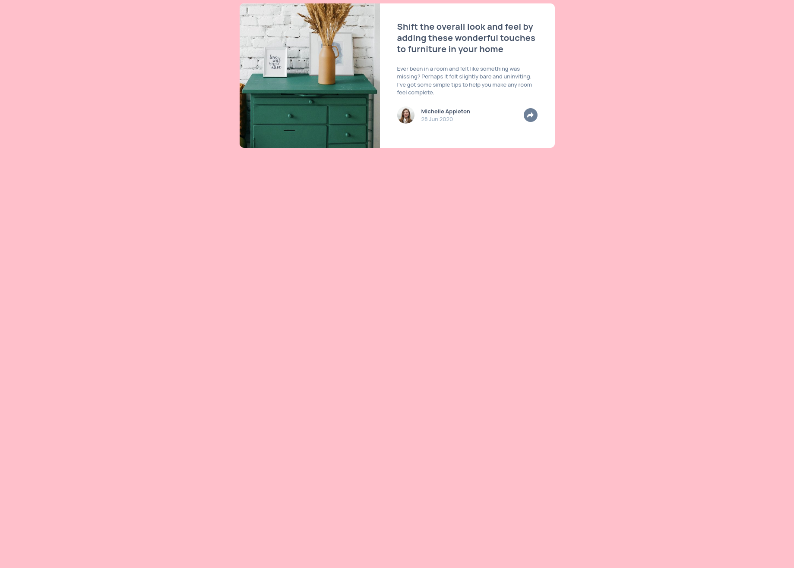

# Frontend Mentor - Article preview component 

This is a solution to the [Article preview component challenge on Frontend Mentor](https://www.frontendmentor.io/challenges/article-preview-component-dYBN_pYFT). Frontend Mentor challenges help you improve your coding skills by building realistic projects. 

## Table of contents

- [Overview](#overview)
  - [The challenge](#the-challenge)
  - [Screenshot](#screenshot)
  - [Links](#links)
- [My process](#my-process)
  - [Built with](#built-with)
  - [Continued development](#continued-development)
- [Author](#author)

## Overview

### The challenge

Users should be able to:

- View the optimal layout for the component depending on their device's screen size
- See the social media share links when they click the share icon

### Screenshot

### Links

- Solution URL: [Solution URL](https://github.com/bandianconde/front-end-practical-projects/tree/main/front-end-mentor-io-challenges/article-preview-component)
- Live Site URL: [Live site URL](https://article-preview-component-omega-lovat.vercel.app/)

## My process

### Built with

- Semantic HTML5 markup
- CSS custom properties
- Flexbox
- Pseudo element
- Mobile-first workflow

## Author

- Frontend Mentor - [@bandianconde](https://www.frontendmentor.io/profile/bandianconde)

