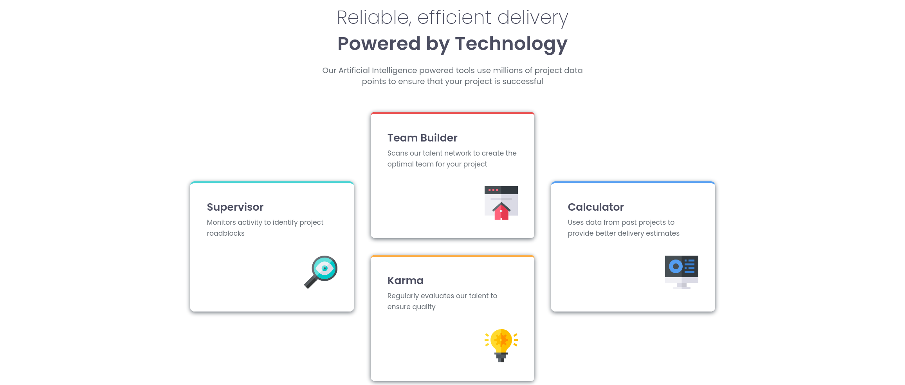

# Four card feature section 

## Table of contents

- [Overview](#overview)
  - [The challenge](#the-challenge)
  - [Screenshot](#screenshot)
  - [Links](#links)
- [My process](#my-process)
  - [Built with](#built-with)

## Overview

### The challenge

Users should be able to:

- View the optimal layout for the site depending on their device's screen size

### Screenshot

### Links

- Solution URL: [Github URL](https://github.com/bandianconde/four-card-feature-section)
- Live Site URL: [Vercel website](https://four-card-feature-section-virid-eta.vercel.app/)

## My process

### Built with

- Semantic HTML5 markup
- Flexbox
- Media Queries
- Mobile-first workflow

