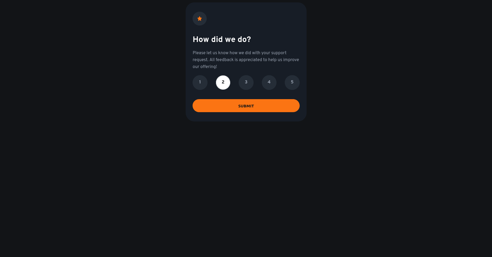

# Frontend Mentor - Interactive rating component

## Table of contents

- [Overview](#overview)
  - [The challenge](#the-challenge)
  - [Screenshot](#screenshot)
  - [Links](#links)
- [My process](#my-process)
  - [Built with](#built-with)
  - [What I learned](#what-i-learned)

## Overview

### The challenge

Users should be able to:

- View the optimal layout depending on their device's screen size
- See hover and focus states for interactive elements
- Change page on submit button

### Screenshot

### Links

- Solution URL: [Github](https://github.com/bandianconde/front-end-practical-projects/tree/main/front-end-mentor-io-challenges/interactive-rating-component)
- Live Site URL: [Vercel](https://interactive-rating-component-three-black.vercel.app/)

## My Process
### Built with

- Media Queries
- CSS custom properties
- Flexbox
- JS
